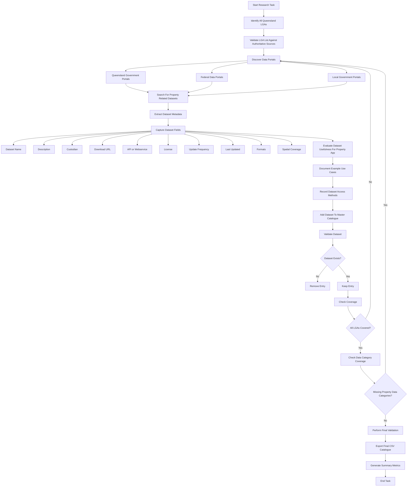
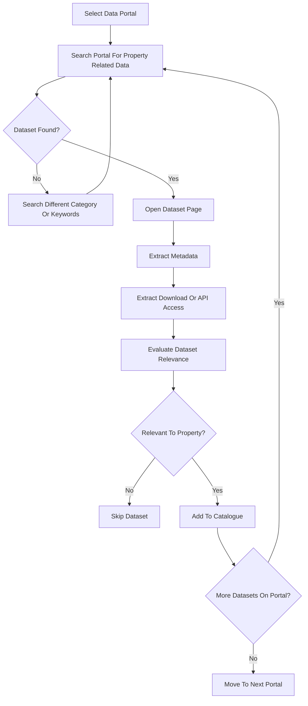

Below is a **production-grade prompt** you can give to a research-capable AI (Deep Research / browsing agent).
It forces **iteration, completeness, validation, and structured CSV output**, which is what you want for building a property data catalogue.

I designed it so the AI **keeps looping until coverage is complete**, verifies sources, and avoids hallucinating datasets.

---

# Prompt: Queensland Property Open Data Deep Research Task

You are an **expert geospatial data researcher specialising in Australian government open data and spatial infrastructure**.

Your task is to **systematically identify and document every open dataset related to property in Queensland, Australia**.

You must **continue iterating until the research is complete**.

Do not stop early.

---

# Objective

Create a **comprehensive catalogue of open datasets related to property information in Queensland** and output the final results in **CSV format**.

The catalogue will later be used to build a **property information web application**.

The research must cover:

* Cadastre
* Property parcels
* Boundaries
* Lot / Plan information
* Easements
* Road parcels
* Road intersections
* Road networks
* Address datasets
* Planning overlays
* Zoning
* Local planning schemes
* Infrastructure corridors
* Flood mapping
* Environmental overlays
* Development approvals
* Land use
* Heritage overlays
* Administrative boundaries
* Local Government Areas (LGA)
* Suburbs / localities
* Road reserves
* Survey plans
* Spatial indexes
* Building footprints
* Imagery
* Elevation
* Utility corridors
* Transport layers
* Any other open dataset relevant to **property intelligence or land information systems**

Only include **datasets that are publicly accessible and legally open**.

Do **not fabricate datasets**.

---

# Step 1 — Identify All Queensland LGAs

First identify **every Local Government Area in Queensland**.

For each LGA collect:

* LGA name
* LGA code
* Region
* Official boundary dataset
* Source of boundary dataset

Use authoritative sources such as:

* Australian Bureau of Statistics
* Queensland Government
* Geoscience Australia

---

# Step 2 — Identify All Open Data Sources

Systematically search these authoritative portals:

Queensland Government:

* [https://data.qld.gov.au](https://data.qld.gov.au)
* [https://qldspatial.information.qld.gov.au](https://qldspatial.information.qld.gov.au)
* [https://qldglobe.information.qld.gov.au](https://qldglobe.information.qld.gov.au)
* [https://spatial-qld-support.atlassian.net](https://spatial-qld-support.atlassian.net)
* [https://publications.qld.gov.au](https://publications.qld.gov.au)

Federal:

* [https://data.gov.au](https://data.gov.au)
* [https://abs.gov.au](https://abs.gov.au)
* [https://geoscience.gov.au](https://geoscience.gov.au)

Local Government portals (important):

Every Queensland council open data portal including but not limited to:

* Brisbane
* Gold Coast
* Sunshine Coast
* Logan
* Moreton Bay
* Ipswich
* Cairns
* Townsville
* Toowoomba
* Mackay
* Rockhampton

You must continue searching until **all councils with open portals have been checked**.

---

# Step 3 — Identify Every Property-Related Dataset

For each portal, find datasets relating to property including:

Spatial datasets
Tabular datasets
API endpoints
Web services (WMS, WFS, REST)

Examples include:

* Digital Cadastral Database (DCDB)
* Land parcel frameworks
* Address management frameworks
* Planning schemes
* Road centreline datasets
* Development approvals
* Easements / tenure layers
* Subdivision datasets
* Property valuations
* Zoning layers

For example, the **Queensland Digital Cadastre Database** represents all land parcels and is updated weekly. ([Queensland Government Open Data][1])

---

# Step 4 — Dataset Metadata Collection

For each dataset collect the following metadata fields:

Dataset Name
Dataset Description
Theme / Category
Data Custodian
Jurisdiction
Geographic Coverage
LGA Coverage (if applicable)
Source Portal
Dataset URL
API / Service URL (WMS/WFS/REST)
Download Formats (CSV, SHP, GeoJSON, GDB, etc.)
License
Update Frequency
Last Updated Date
Spatial Resolution
Coordinate System
Key Attributes Included
File Size (if known)

---

# Step 5 — Evaluate Dataset Relevance

For each dataset include analysis fields:

Property App Usefulness (High / Medium / Low)

Usefulness Explanation

Example Use Cases:

* Property boundary lookup
* Planning restriction checks
* Road access verification
* Flood risk identification
* Development feasibility analysis
* Infrastructure proximity
* Address validation
* Land parcel visualization

---

# Step 6 — Access Methods

Document **exact methods for retrieving the data**:

Include:

Download URL
API endpoint
Example query
Authentication requirements (if any)

If possible provide:

Example API calls

Example:

REST endpoint
WMS endpoint
Bulk download link

Many Queensland spatial datasets can be downloaded or accessed via web map services through the **QSpatial catalogue**, which supports formats like Shapefile, KML and WMS connections. ([Business Queensland][2])

---

# Step 7 — Iterative Research Loop

After each research pass:

1. Evaluate whether **any category of property data is missing**
2. Identify **new portals or agencies**
3. Continue researching

Continue looping until **all categories are fully covered**.

Missing categories might include:

* cadastral layers
* planning overlays
* transport
* environmental overlays
* utilities
* address systems
* statistical geography
* development datasets

Do not stop until:

* Every Queensland LGA has been covered
* Every major government data portal has been searched
* Every property-relevant dataset has been documented

---

# Step 8 — Validation

Before finishing:

Verify that every dataset:

* Exists
* Is accessible
* Is actually open data
* Has a legitimate source

Remove any uncertain or unverifiable datasets.

---

# Step 9 — Final CSV Output

Output the results as a **single CSV table** with the following columns:

```
DatasetName
Category
Description
DataCustodian
Portal
GeographicCoverage
LGA
AccessMethod
DownloadURL
APIEndpoint
Format
UpdateFrequency
LastUpdated
License
UsefulnessRating
UsefulnessExplanation
ExampleUseCases
Notes
```

---

# Step 10 — Completeness Check

Before finishing:

Provide a summary including:

Total datasets identified
Total portals searched
Total LGAs covered
Categories covered

If any gaps remain:

Continue iterating until resolved.

---

# Key Rules

* Do not fabricate data
* Only use authoritative sources
* Prefer government sources
* Always validate datasets
* Be extremely thorough

Your goal is to produce **the most complete catalogue of Queensland property open data possible**.


[1]: https://www.data.qld.gov.au/dataset/cadastral-data-queensland-series?utm_source=chatgpt.com "Cadastral data - Queensland series - Dataset - Open Data Portal | Queensland Government"
[2]: https://www.business.qld.gov.au/running-business/support-services/mapping-data-imagery/data/qspatial?utm_source=chatgpt.com "QSpatial | Business Queensland"


# Research Loop



# Data Discovery Subloop

